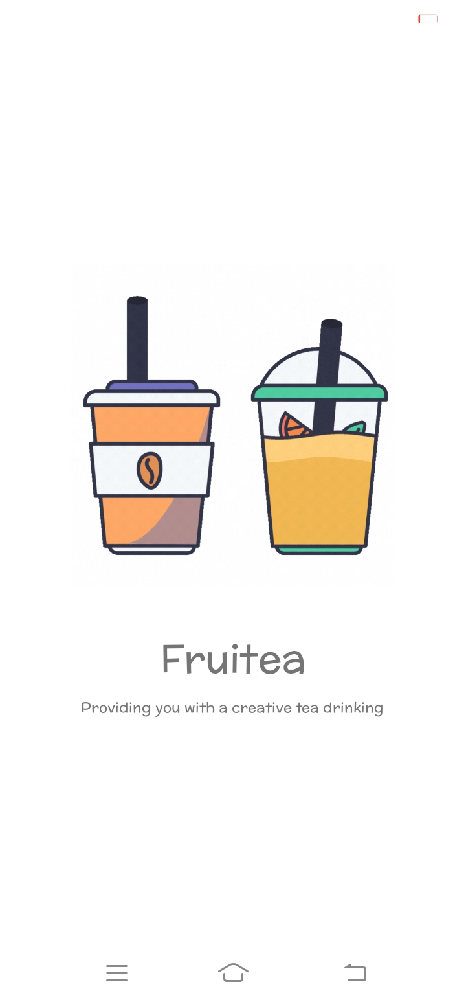
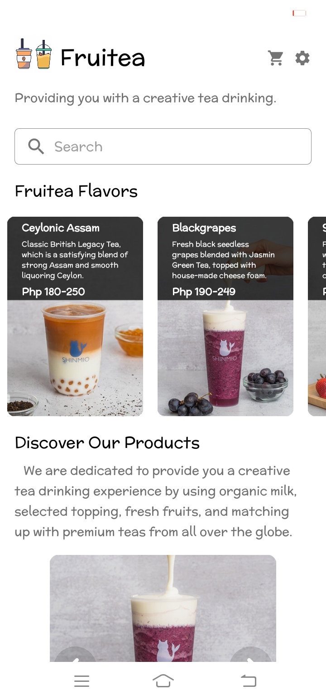
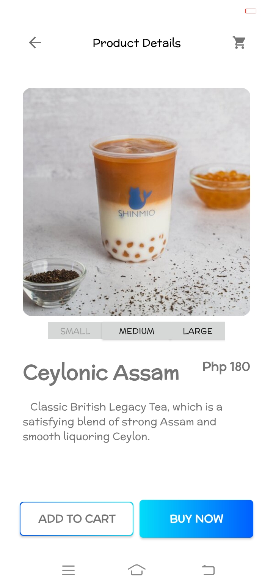

# Fruitea: Mock-up Online Shop

An Android shop mock-up application written purely in Java. I was shocked seeing how the mobile community developers been developing Android applications with Kotlin and Jetbrains' compose, so this will be the last time I will be writing an Android app on pure Java (just kiddin').

Nevertheless, I do not own the images used in this mock-up app. Most of them are of [Shinmio Tea](https://www.shinmiotea.com/)'s property.

## Screenshots

| Splash Screen | Main Menu | Product View |
|---------------|-----------|-------------------|
|  |  |  |

## Demo

You can download the signed APK build from the release section.

## License

See [LICENSE.txt](LICENSE.txt).

*Copyright 2022 (c) Nathanne Isip*